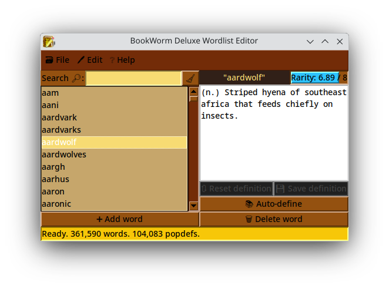

# BookWorm Deluxe wordlist (and popdefs) editor

This program edits the wordlist and popup definitions for the game [BookWorm Deluxe by PopCap Games](https://oldgamesdownload.com/bookworm-deluxe/) released in 2006. I created this program after augmenting the wordlist more manually using [this free list of English words by dwyl](https://github.com/dwyl/english-words), but then discovering that it contained some errors, along with real words that I felt deserved a popdef.

## Dependencies:
This program relies on Python >= 3.10 (formally written in Python 3.13), plus the following non-native Python libraries, which can be installed using Pip:
- [NLTK](https://pypi.org/project/nltk/)
- [wordfreq](https://pypi.org/project/wordfreq/)

You can find executables with bundled Python and the dependencies in the Releases page of this repository.

## Usage:
To run from source, install Python 3.10 or newer, and then the dependencies, then use Python to run the .pyw program.

For the auto-define button to work, the program requires an internet connection to download the NLTK wordnet package when it starts up for the first time. If it doesn't have one, it will still function mostly-normally, but the button will just show an error message. It will try to download wordnet again on the next startup.

### Program operation:
When the program opens, it will default to opening the BookWorm Deluxe folder in the expected system location per your platform. If on Linux or MacOS, it will assume the default Wine prefix in your user directory. If it does not find the wordlist.txt and popdefs.txt files in this default location, or the default location doesn't exist, it will ask you to choose the BookWorm Deluxe folder manually. If your installation of BookWorm Deluxe is not in the default install location, you can optionally set the `BOOKWORM_GAME_PATH` environment variable to the game program folder, and the program will default to looking there instead. On Linux, this can be done within a Desktop Entry file you can create for the editor. Simply add `env 'BOOKWORM_GAME_PATH=/path/to/Bookworm Deluxe/' ` (with a space separating it from the rest of the command) to the beginning of the command in the `Exec=` line. Alternatively, search online for how to permanently set environment variables in your operating system.

Once the program loads the files, you should see a list of words in the left pane. The bottom of the window shows the current number of words and popdefs in memory when idle, and status information on any currently running threaded operations.
- Select a word to see its usage frequency according to wordfreq (zero for no wordfreq entry), and its current popdef (blank for no popdef). If the usage frequency is below [an arbitrary value](bookworm_utils.py#RARE_THRESH) where I think it might need a popdef, it will show in red. Otherwise, it will show in black. While a word is selected you can:
    - Edit the popdef and save it. Note that if you select a different word before saving the definition, it will reset.
    - Reset the popdef to what it was the last time you saved it.
    - Auto-create a popdef using the NLTK wordnet English dictionary.
    - Delete the word from the wordlist.
- You can search for a word with the search box, using the X button to clear the search query.
- You can add a new word to the wordlist with the Add word button. Once added, it will become selected.
- The File menu provides the following operations:
    - Open (Ctrl + O): Open a different word list and popdefs file pair.
    - Reload (Ctrl + R): Reload the current word list and popdefs file pair, reversing all your changes.
    - Save (Ctrl + S): Save your changes. Automatically asks if you would like to do a backup if the original files are older than my program.
    - Backup existing (Ctrl + B): Copy the existing files to a backup named version in the same directory.
- The Edit menu provides the following operations:
    - Add several words: Select a text file of new words and add them all.
    - Auto-define undefined rare words: Find all words below my arbitrary usage threshold and attempt to auto-define them.
    - Delete several words: Select a text file of words and delete them all.
    - Delete words of invalid length: Removes words that BookWorm Deluxe will not allow as moves because of their length.
    - Delete orphaned definitions: Removes definitions from the popdefs that do not have a word in the wordlist.
    - Delete duplicate word listings: Make sure that none of the entries in the word list are redundant.

## Information on antivirus false positives for PyInstaller executables:

Recently, I discovered that multiple antivirus services are consistently flagging any and all Windows executables packaged with PyInstaller. This is a mistake: While malware could certainly be written in Python and subsequently packaged with PyInstaller into an exe, the exe would be malicious because of the packaged Python code, not because of PyInstaller. I've reported the problem to the antivirus services that I found false positive reporting forms for, but often only the specific app version was whitelisted, if anything at all. I tested BookWorm Deluxe Wordlist Editor v1.5.0 win x64 on April 27 in VirusTotal: It showed no malicious behavior from the application inside sandbox tests, and provided the following list of flags from security vendors.

<table>
    <tr>
        <th>Antivirus service</th>
        <th>Report for this PyInstaller EXE</th>
    </tr>
    <tr>
        <td>Bkav Pro</td>
        <td>W64.AIDetectMalware</td>
    </tr>
    <tr>
        <td>Elastic</td>
        <td>Malicious (moderate Confidence)</td>
    </tr>
    <tr>
        <td>Jiangmin</td>
        <td>TrojanSpy.Agent.afwu</td>
    </tr>
    <tr>
        <td>Malwarebytes</td>
        <td>Malware.AI.3767809634</td>
    </tr>
    <tr>
        <td>SecureAge</td>
        <td>Malicious</td>
    </tr>
    <tr>
        <td>Skyhigh (SWG)</td>
        <td>BehavesLike.Win64.Agent.tc</td>
    </tr>
</table>

This is a known issue with, or rather limitation of, PyInstaller, and there is nothing its devs can really do about it. Since then, Malwarebytes in particular has tried to remedy the issue on their end, but a new bootloader update for PyInstaller could change that again. I'd like to thank them for that effort, in any case. Although I don't personally use their AV at the moment (since I mainly run Linux), it does seem an honorable thing for them to do IMO.

## Bundling yourself:
If you wish to bundle the application yourself with PyInstaller, you can run `pyinstaller_build.sh` in Windows Git Bash or Linux. It requires that:
- You have an internet connection.
- The `python` and `pip` command point to Python 3.10 or newer and it's respective Pip tool (may point to Python 2.7 on some systems).
- The venv package for that Python is installed.
It will automatically set up a clean virtual environment with the program's dependencies and PyInstaller, update the word frequency list, then package the application.

Hope this helps!

## Legal:
Copyright 2025 Wilbur Jaywright d.b.a. Marswide BGL.

Licensed under the Apache License, Version 2.0 (the "License");
you may not use this file except in compliance with the License.
You may obtain a copy of the License at

    http://www.apache.org/licenses/LICENSE-2.0

Unless required by applicable law or agreed to in writing, software
distributed under the License is distributed on an "AS IS" BASIS,
WITHOUT WARRANTIES OR CONDITIONS OF ANY KIND, either express or implied.
See the License for the specific language governing permissions and
limitations under the License.

**S.D.G.**
